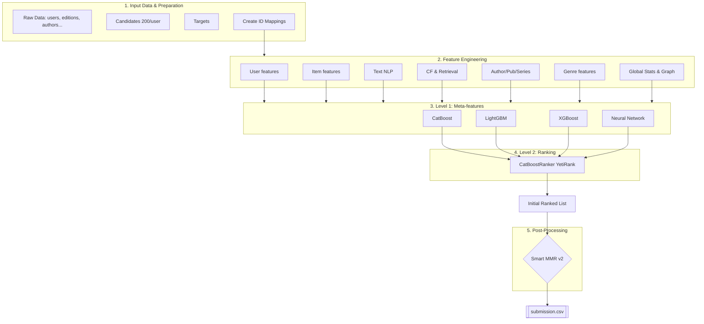

# by-pages-hackathon-solution

Solution for the AI Academy hackathon **“By Pages”**.  
## Score: **0.719**
The task is to build a ranked list of 20 books (`edition_id`) for each user from a pool of 200 candidates, balancing two objectives:

- maximum **relevance** of recommendations;
- sufficient **genre diversity** in the output.

The final solution combines:
- a large number of handcrafted features;
- multiple first-level models;
- stacking;
- a final ranker;
- post-processing to improve diversity@20.

---

## Task

For each `user_id` from `targets.csv`, it is required to generate a top-20 recommendation list from 200 candidates in `candidates.csv`.

Submission format:

```csv
user_id,edition_id,rank
```

where:
- `rank` is from 1 to 20;
- each user must have exactly 20 recommendations;
- `edition_id` must not repeat within one user;
- all recommended books must belong to the candidate pool for that user.

### Metric

The final score is computed as a combination of:

- **NDCG@20** — ranking quality;
- **Diversity@20** — genre diversity of relevant recommendations.

Thus, the task requires not only accurate personalization but also a careful balance between relevance and expanding user interests.

---

## Solution Idea

The final solution is a **hybrid ranking pipeline**:



1. A large set of features is constructed:
   - user features;
   - item features;
   - user-item interaction features;
   - text features;
   - graph features;
   - sequential / session / i2i features;
   - statistical features by genres, authors, publishers, age, etc.

2. First-level models are trained:
   - `CatBoostClassifier`
   - `CatBoostRegressor`
   - `LGBMClassifier`
   - `LGBMRegressor`
   - `XGBClassifier`
   - `XGBRegressor`
   - tabular `Neural Network`

3. Their predictions are used as **meta-features**.

4. A **CatBoostRanker** with `YetiRank` is trained on top.

5. After ranking, **diversity-aware reranking** is applied to improve genre diversity without significantly harming relevance.

---

## What was used in the solution

### Models
- CatBoost
- LightGBM
- XGBoost
- PyTorch Neural Network
- Implicit ALS
- TruncatedSVD
- KMeans

### Main approaches
- feature engineering
- stacking
- learning-to-rank
- item-to-item similarity
- text embeddings
- graph features
- sequential features
- diversity-aware reranking

---

## Features

A large number of features were used in the solution. Main groups:

### 1. User features
- number of user interactions;
- wishlist / read ratio;
- average rating;
- first and last interaction timestamps;
- gender and age;
- user genre history.

### 2. Item features
- book popularity;
- number of unique users;
- average rating;
- publication age;
- author popularity;
- description length;
- language;
- series number.

### 3. Text features
- book description embeddings;
- PCA over text embeddings;
- book cluster in embedding space;
- similarity between candidate and user history;
- similarity with time-decayed user profile.

### 4. Collaborative filtering / retrieval features
- ALS score;
- SVD similarity;
- SWING item-to-item;
- rating-based item-to-item;
- session co-occurrence;
- cluster affinity;
- cohort popularity.

### 5. Author / publisher / series features
- author affinity;
- author recency;
- author loyalty;
- favorite publisher;
- next-in-series;
- sequel-of-read-author;
- binge features;
- author hook.

### 6. Genre features
- genre affinity;
- user genre entropy;
- pair genre similarity;
- novelty / diversity-related features.

### 7. Global statistical features
- completion rate;
- conversion rate;
- stickiness;
- trend score;
- trend acceleration;
- demographic popularity;
- conformity;
- rarity match;
- complexity match;
- age distance score;
- graph pagerank / hubs / authorities.

---

## Experiments

The development process consisted of several stages.

### Stage 1. Baseline ranker
Initially, a standard `CatBoostRanker` was used, but it produced a very low score — around **0.09**.

After analysis, it became clear that one of the main issues was poor training sample construction and negative sampling.

### Stage 2. Negative sampling
A more advanced negative sampling strategy was tested instead of random sampling. This significantly improved the score, but the solution became highly unstable: in some configurations the score increased a lot, while in others it collapsed. At one point, a score of about **0.59** was achieved, but the approach lacked stability.

### Stage 3. Pipeline stabilization
The pipeline was then almost completely rewritten with a focus on stability. This version improved the score to approximately **0.64**.

### Stage 4. Feature engineering
Next, the focus shifted to features. Through extensive data analysis and trial-and-error experiments, the following were added:
- statistical features;
- clustering;
- SVD;
- item-to-item features;
- PCA over text;
- author, publisher, and genre features;
- graph and sequential features.

This stage improved the score to around **0.68–0.69**.

### Stage 5. Pipeline change and stacking
Further improvements through small tweaks became difficult, so the pipeline was redesigned. Instead of a single ranker, classification and regression models were trained, and their predictions were used as input features for the final ranker.

This change increased the score to approximately **0.705**.

Additionally, a clear pattern was observed: the more strong first-level models were added (`xgb`, `lgbm`, `catboost`, `nn`), the higher the final score.

### Stage 6. Post-processing for diversity@20
Since the final metric included diversity, post-processing became crucial.

Different reranking approaches were tested:
- standard MMR;
- greedy methods;
- hard reranking;
- additional penalties;
- genre graph.

The best result was achieved with **smart MMR**:
- accounting for user diversity preference;
- reducing penalties between “friendly” genres;
- protecting sequels (`sequel immunity`).

This component provided a strong balance between ranking quality and diversity.

### Final result
Best public score: **0.7191889299588444**.

---

## Final solution

Best pipeline:

- extensive handcrafted features;
- first-level models:
  - CatBoost classifier/regressor
  - LightGBM classifier/regressor
  - XGBoost classifier/regressor
  - Neural Network
- meta-features based on their predictions;
- final `CatBoostRanker (YetiRank)`;
- post-processing via **smart MMR v2** with genre graph and series-aware logic.

This combination provided the best trade-off between relevance and diversity.

---

## Repository structure

```bash
.
├── README.md
├── solution.ipynb
└── requirements.txt
```

---

## Run

### Install dependencies

```bash
pip install -r requirements.txt
```

### Main libraries
- pandas
- numpy
- scipy
- scikit-learn
- catboost
- lightgbm
- xgboost
- torch
- implicit
- sentence-transformers
- networkx

---

## Data

The dataset must be downloaded separately from Kaggle:

https://www.kaggle.com/datasets/andrewsokolovsky/by-pages-ai

The following tables are used:

- `users.csv`
- `editions.csv`
- `authors.csv`
- `genres.csv`
- `book_genres.csv`
- `interactions.csv`
- `candidates.csv`
- `targets.csv`

---

## Prediction pipeline

1. Load data and prepare mappings.
2. Build text embeddings and clusters.
3. Compute global statistics and interaction maps.
4. Generate features for train and test candidates.
5. Train first-level models.
6. Generate meta-features.
7. Train final ranker.
8. Apply diversity-aware reranking.
9. Generate `submission.csv`.

---

## Conclusion

This solution demonstrates that high performance in recommendation tasks is achieved not by a single model, but by combining:

- strong feature engineering,
- multiple models,
- stacking,
- and proper post-processing aligned with the competition metric.

---

## Contacts
Telegram: @main4562 and @FeelAiChallenge
If you like this solution, please give the repository a ⭐.
